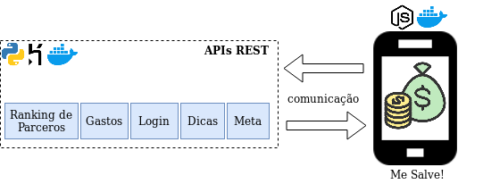

# Mega Hackathon - Flourish

### Prequisitos de instalação
- [Docker](https://docs.docker.com/get-docker/)
- [docker-compose](https://docs.docker.com/compose/install/)

### Construir imagens

- docker-compose up --build

### Acessar servidor Django (local)

- http://localhost:8000
- http://localhost:8000/login/

### Gerar dados Fake para o bd no backend
- cd dados/
- docker-compose up --build

### Servidor remoto do [Me Salve!](https://still-mesa-79761.herokuapp.com/)

### Arquitetura de solução (Macro)

